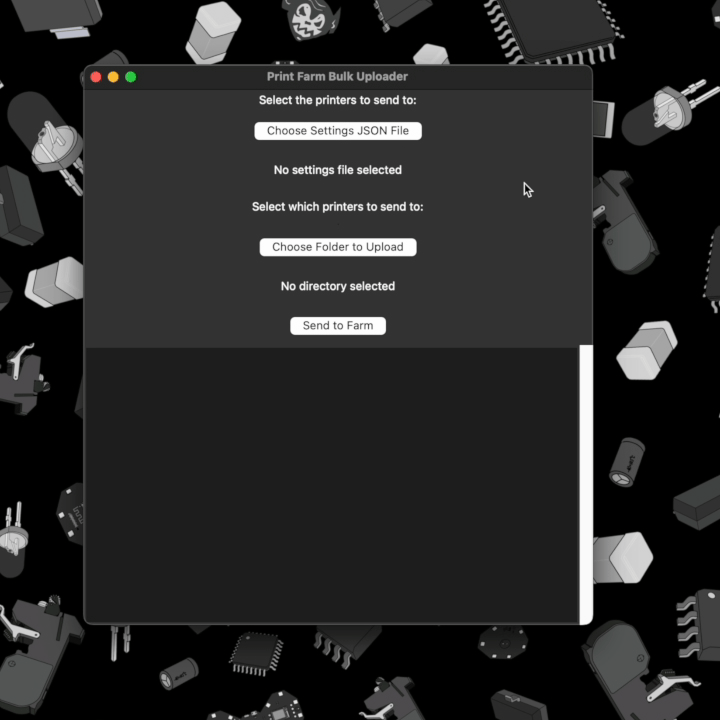

# FarmUpload

A bulk file uploading tool for 3D printers.



Modern 3D printer slicers are excellent, but lack some print farm specific features. Some printers have an open FTP server running that allows clients to upload files. This application takes advantage of that feature to bulk upload pre-sliced gcode to every printer in a print farm. It's on the roadmap to support Moonraker and Octoprint file sending via HTTP POST requests.

The application is a very lightweight wrapper around Python's `ftplib` module, adding support for implicit TLS required by BambuLab P1P printers, and a tiny UI for adding a JSON of printer connection settings and selecting your folder to upload.

## Installation

### Mac .app

There is currently only a Mac .app pre-built for this application. Just download the .app file from the latest release and run as an application.

### From Source

Make sure you have Python 3 installed:

```python
python3 --version
> Python 3.9.19
```

If not, [download and install it](https://www.python.org/downloads/).

Clone the repo to your computer:

```bash
git clone https://github.com/opulo-inc/farm-upload.git
```

Inside the new `farm-upload` folder, you'll find a `settings-example.json` file. Duplicate it and rename it `settings.json`.

Open settings.json in a text editor. Update the IP addresses and passwords to match the "IP" and "Access Code" in your printer's UI. The "name" field can be whatever you'd like. You can add more printers by extending the JSON "printers" array.


To run the application, from the `farm-upload` folder, do:

```bash
python3 src/FarmUpload.py
```

## Usage

When the application has booted, click on the "Choose Settings JSON File" to select the `settings.json` file you made previously.

Click on "Choose Folder to Upload" to select a folder where all your pre-sliced gcode that you'd like to send to the farm resides.

Hit "Send to Farm" to upload all files in the folder to your print farm. The log will notify you of success or failure.

## Todo

- Test on printers other than BambuLab P1P and P1S
- Support deleting existing files from the printer's SD
- Handle uploading files that share a name with an existing file on the SD
